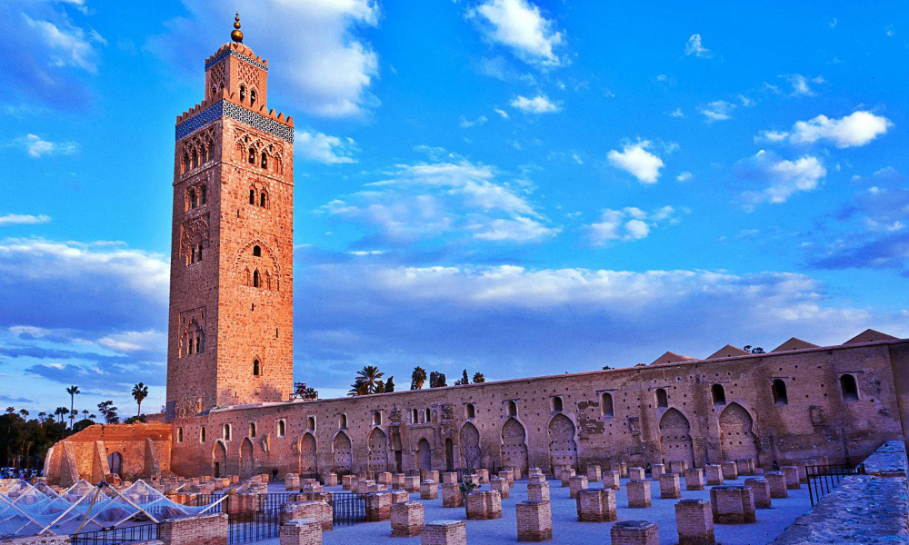
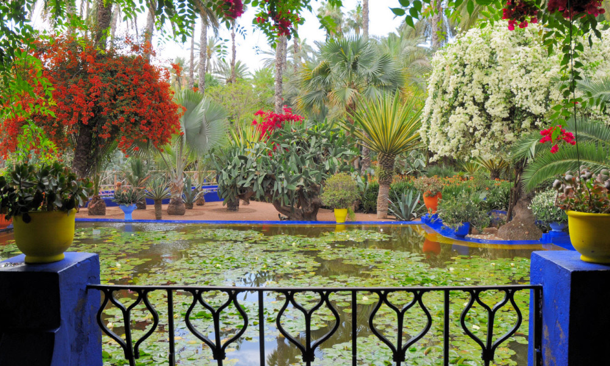

# Les places touristique

- Place Jamaa el fna
- Mosquée Koutoubia
- Les Jardins Majorelle

<!-- new slide -->

## Place Jamaa el fna

{:width="500px" }
*Jamaa el fna*

<!-- note -->

Cœur touristique de la ville, la place Jamaa el Fna est le quartier le plus vivant de Marrakech. De jour ou de nuit, cette place est en permanence peuplée de touristes.

<!-- new slide -->

## Mosquée Koutoubia

{:width="500px" }
*koutoubia*

<!-- note -->

Considéré comme l’un des plus beaux monuments d’Afrique, le minaret de la Koutoubia est aussi le site les plus ancien de la ville ocre. Il a été batti à l’époque du règne des Al Mohadde, en 1147.

<!-- new slide -->

## Les Jardins Majorelle

{:width="500px" }
*Jardins Majorelle*

<!-- note -->

Un mélange de plantes et de couleurs qui donne aux visiteurs une sensation de fraicheur. Un cadre poétique conçu par le peintre Jaques Majorelle qui vécut à Marrakech à partir de 1924. Les Jardins Majorelle furent ensuite rachetés et restaurés par Yves Saint Laurent en 1980.

<!-- new slide -->
