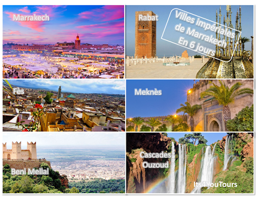

# Conclusion

{:width="500px" }
*Tous les places touristiques*

<!-- note -->

Marrakech n’est pas seulement une destination de culture mais un choix incontournable pour le tourisme de découverte et d’aventure. La ville des sept saints s’installe idéalement au centre du royaume et relie le nord du pays aux régions du Sud. Un point de départ inévitable pour découvrir les plus belles destinations de nature dans le Maroc.